# PowSyBl Network Area Diagram

[](https://github.com/powsybl/powsybl-network-area-diagram/actions)
[](https://sonarcloud.io/component_measures?id=com.powsybl%3Apowsybl-network-area-diagram&metric=coverage)
[](https://sonarcloud.io/dashboard?id=com.powsybl%3Apowsybl-network-area-diagram)
[](https://www.mozilla.org/en-US/MPL/2.0/)
[](https://join.slack.com/t/powsybl/shared_invite/zt-rzvbuzjk-nxi0boim1RKPS5PjieI0rA)

PowSyBl (**Pow**er **Sy**stem **Bl**ocks) is an open source framework written in Java, that makes it easy to write complex
software for power systems’ simulations and analysis. Its modular approach allows developers to extend or customize its
features.

PowSyBl is part of the LF Energy Foundation, a project of The Linux Foundation that supports open source innovation projects
within the energy and electricity sectors.

<p align="center">

</p>

Read more at https://www.powsybl.org !

This project and everyone participating in it is governed by the [PowSyBl Code of Conduct](https://github.com/powsybl/.github/blob/main/CODE_OF_CONDUCT.md).
By participating, you are expected to uphold this code. Please report unacceptable behavior to [powsybl-tsc@lists.lfenergy.org](mailto:powsybl-tsc@lists.lfenergy.org).

## PowSyBl vs PowSyBl Network Area Diagram

PowSyBl Network Area Diagram is a component build on top of the `Network` model available in the PowSyBl Core repository responsible for generating a concise diagram of the whole network or of a part of the network, showing in particular the interconnections between the different voltage levels.
A network area diagram emphasizes the electrical structure of the network, and may differ substantially from the network physical geography.
It displays the graph whose nodes are the network voltage levels, and whose edges are the lines and transformers between those voltage levels.
Additional information

## Getting started
In order to generate a SVG from a given network, we need to add some Maven dependencies:
- `powsybl-network-area-diagram` for the network area diagram itself
- `powsybl-iidm-impl` for the network model
- `powsybl-config-test` and `powsybl-ieee-cdf-converter` to load the `Network` example
- `slf4j-simple` for simple logging capabilities

```xml
<properties>
    <powsybl.nad.version>0.2.0</powsybl.nad.version>
    <powsybl.core.version>4.6.0</powsybl.core.version>
    <slf4j.version>1.7.22</slf4j.version>
</properties>

<dependencies>
    <dependency>
        <groupId>com.powsybl</groupId>
        <artifactId>powsybl-network-area-diagram</artifactId>
        <version>${powsybl.nad.version}</version>
    </dependency>
    <dependency>
        <groupId>com.powsybl</groupId>
        <artifactId>powsybl-iidm-impl</artifactId>
        <version>${powsybl.core.version}</version>
    </dependency>
    <dependency>
        <groupId>com.powsybl</groupId>
        <artifactId>powsybl-config-test</artifactId>
        <version>${powsybl.core.version}</version>
    </dependency>
    <dependency>
        <groupId>com.powsybl</groupId>
        <artifactId>powsybl-ieee-cdf-converter</artifactId>
        <version>${powsybl.core.version}</version>
    </dependency>
    <dependency>
        <groupId>org.slf4j</groupId>
        <artifactId>slf4j-simple</artifactId>
        <version>${slf4j.version}</version>
    </dependency>
</dependencies>
```

Then we simply need to load the example network and then generate the corresponding network area diagram SVG.
```java
Network network = IeeeCdfNetworkFactory.create30();
new NetworkAreaDiagram(network).draw(Path.of("/tmp/diagram.svg"));
```
We obtain the following SVG:



If only part of the network is wanted, we can provide a voltage level id and a depth to generate a partial graph of the network,
for instance the subgraph centered on voltage level `"VL25"` with a depth of `2`:

```java
new NetworkAreaDiagram(network, "VL25", 2).draw(Path.of("/tmp/partial_diagram.svg"));
```

This leads to following diagram:


Note that the chosen example network is the IEEE 30-bus test case, which corresponds to a basic approximation of the American electric power system in December 1961.
